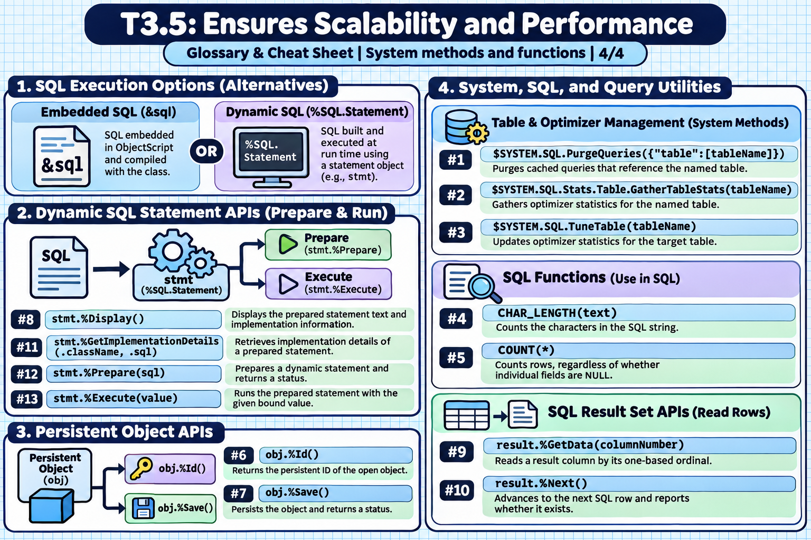

# T3.5: Ensures Scalability and Performance — visual study guides

[Approfondimenti dagli esercizi](<Approfondimenti esercizi/README.md>)

[Chapter contents](index.md) · [Full guide](study.md) · [Practice questions](quiz.md)

Generated learning summaries. Read the full notes for detailed explanations and exact code. [Technical review notes](../../visual-technical-notes.md).

## Visual guide — sections 1–3

Covers:

- 1. TUNE TABLE for gathering table statistics
- 2. Interpreting basic query plans
- 3. Testing code correctness and performance

## Glossary & Cheat Sheet

[Open the text recap](study.md#glossary--cheat-sheet).
