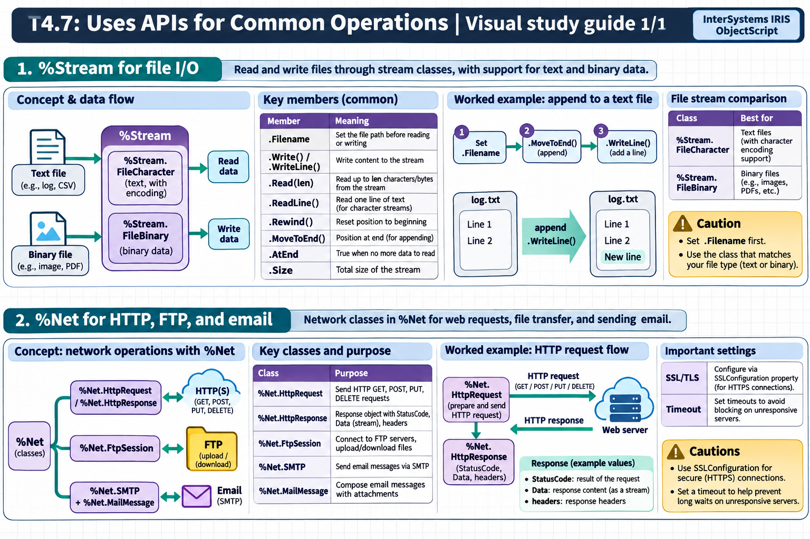
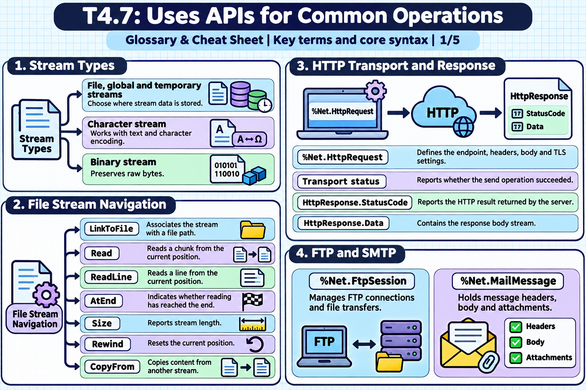
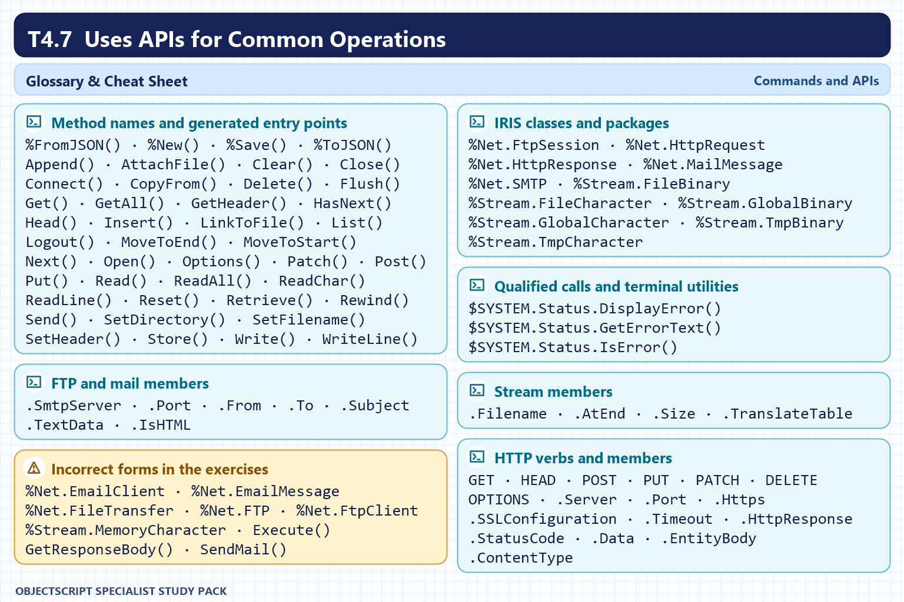
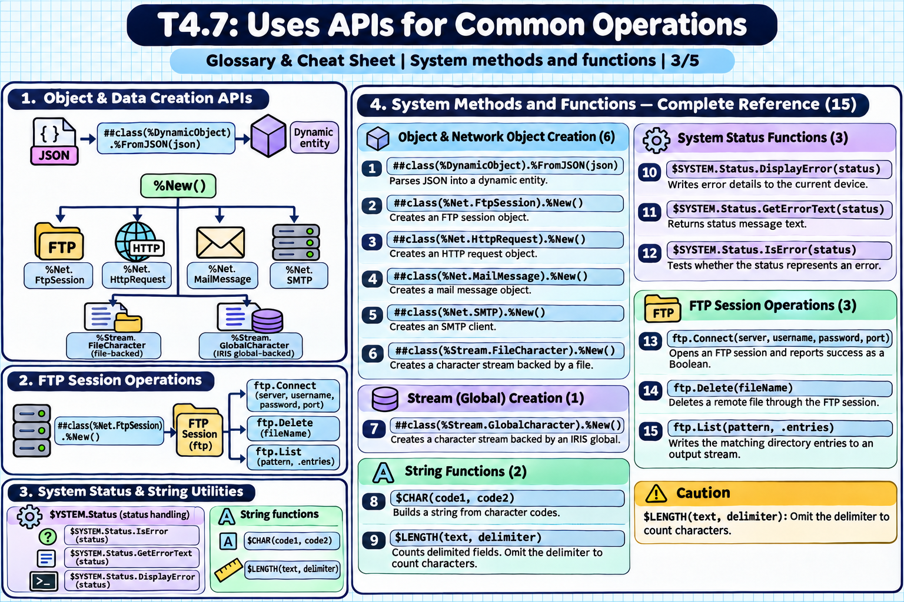
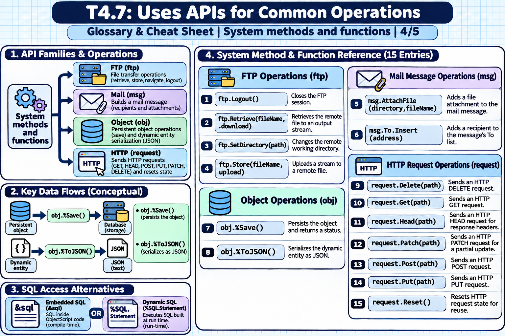
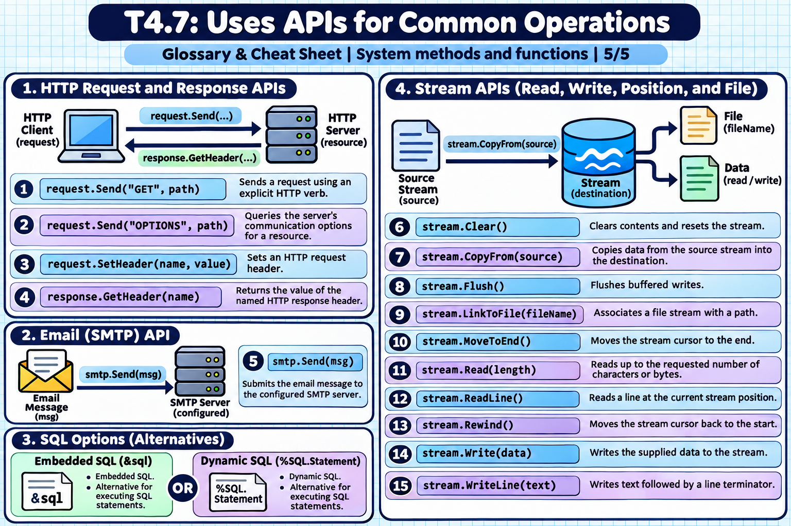

# T4.7: Uses APIs for Common Operations — visual study guides

[Approfondimenti dagli esercizi](<Approfondimenti esercizi/README.md>)

[Chapter contents](index.md) · [Full guide](study.md) · [Practice questions](quiz.md)

Generated learning summaries. Read the full notes for detailed explanations and exact code. [Technical review notes](../../visual-technical-notes.md).

## Visual guide — sections 1–2

Covers:

- 1. %Stream for file I/O
- 2. %Net for HTTP, FTP, and email

## Glossary & Cheat Sheet

[Open the text recap](study.md#glossary--cheat-sheet).
